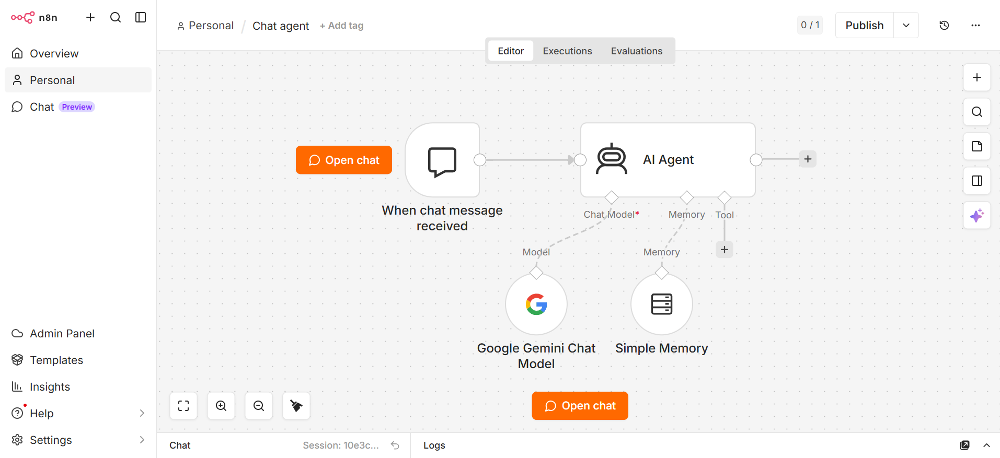

## 🤖 My First Smart AI Agent (Built with n8n + Gemini)

Hey there! 👋 Thanks for stopping by my repo. 

This is a personal project I put together to stop building boring, forgetful chatbots and actually give them a functional brain. It uses *n8n* to wire everything up and *Google Gemini* as the core intelligence.

### 🧠 The Cool Part: It Actually Remembers!
Most basic AI bots have zero short-term memory—you talk to them, and they instantly forget who you are in the next message. 

To fix that, I hooked this agent up with *Window Buffer Memory*. Now, it keeps track of the context and holds a smooth, human-like conversation without losing the plot midway.

### 🛠️ What's Inside the Box?
* *Chat Trigger Node:* The starting point where the user says hello.
* *AI Agent:* The main router managing the logic.
* *Gemini Model:* The heavy lifter handling the smart responses.
* *Simple Memory:* The exact node that stops the bot from getting amnesia.

### 🚀 Want to run it yourself?
It's super easy. You don't need to rebuild it from scratch:
1. Grab the Simple-gemini-chat-agent.json file from this repo.
2. Open your n8n (Local or Cloud), click the 3 dots on the top right, and hit *Import from File*.
3. Plug in your own Google Gemini API key, and boom—you have your own memory-backed AI agent running in seconds!
### 📸 Workflow Screenshots
Here is how the workflow looks inside n8n:

.png)
